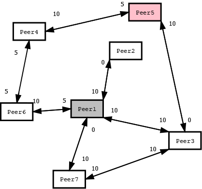

<p align="center">
     <h1 align="center">State-Channels - Hybrid decentralized P2P Network with routing algorythm</h1>
</p>
This project consists in creating a software system capable of connecting to a P2P overlay network. In particular, it refers to a P2P network of State Channels.
A state channel is a channel between two peers capable of maintaining a state until the latter is closed. The state is made up of the balance sheet of the two peers, that needs to be consistent after every exchange of digital currency between them.

# Table of contents

- [Installation and usage](#installation-and-usage)
- [Features](#features)
- [Network architecture](#network-architecture)
- [Contact](#contact)


# Installation and usage

To compile the peer and the server, a "start.sh" script file was provided which will run the server. To be able to start a peer you need to go to the peerSource directory and run the following command:

```sh
  ./peer IDPEER IPSERVER CHANNELPORT UPDATEPORT TRANSACTIONPORT
```
The IDPEER is an integer greater than 0


## Features
The system features are listed below:
1. Transfer currency from your balance sheet to another peer;
2. Open a direct state channel with another peer if and only if there is no path that connects the two peers within the overlay network.
3. View your own state channels;
4. Close a state channel ensuring the consistency of the balance sheets and the stability of the system.

## Network architecture
The system is based on a hybridized decentralized peer-to-peer network design model.

A common hybrid model has a central server that helps peers find each other. It was favored over models with unstructured pure networks or pure structured networks because some functions, such as search, require centralized functionality but benefit from the decentralized aggregation of nodes provided by unstructured networks.

Below there is an example of the management of a transaction by the overlay network that covers different routing cases. Let's assume a transaction of amount 5 by Peer 1 destined for Peer 5.
<p align="center">
     
</p>
## Contact

Andrea Lombardi - [@LinkedIn](https://www.linkedin.com/in/andrea-lombardi/)
